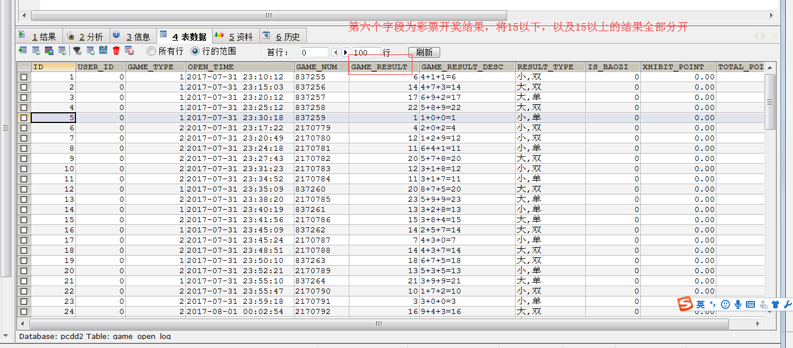
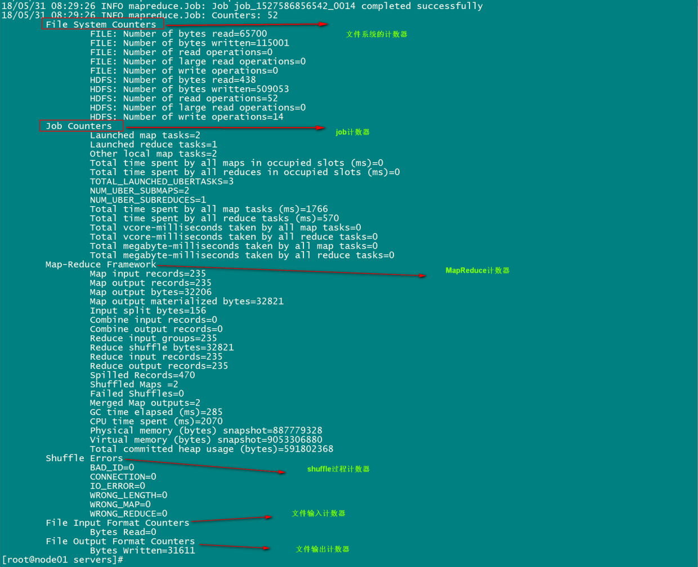
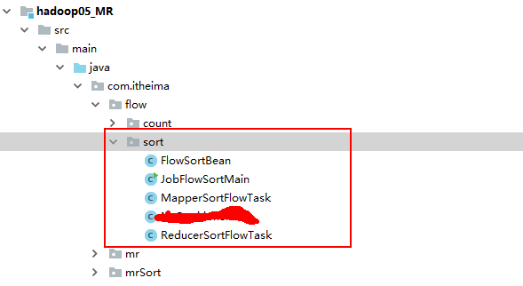

# hadoop-MapReduce

## 1.MapReduce 分区与reduceTask的数量

​	在 MapReduce 中, 通过我们指定分区, 会将同一个分区的数据发送到同一个 Reduce 当中进行处理

​	例如: 为了数据的统计, 可以把一批类似的数据发送到同一个 Reduce 当中, 在同一个 Reduce 当中统计相同类型的数据, 就可以实现类似的数据分区和统计等

​	其实就是相同类型的数据, 有共性的数据, 送到一起去处理, 在Reduce 当中默认的分区只有一个

​	MapReduce当中的分区类图


需求：将以下数据进行分开处理

​	详细数据参见partition.csv  这个文本文件，其中第五个字段表示开奖结果数值，现在需求将15以上的结果以及15以下的结果进行分开成两个文件进行保存

 

分区实现步骤：

* 第一步: 定义  Mapper

​	这个 Mapper 程序不做任何逻辑, 也不对 Key-Value 做任何改变, 只是接收数据, 然后往下发送

```java


import org.apache.hadoop.io.IntWritable;
import org.apache.hadoop.io.LongWritable;
import org.apache.hadoop.io.Text;
import org.apache.hadoop.mapreduce.Mapper;

import java.io.IOException;

public class MapCPTask extends Mapper<LongWritable,Text,IntWritable,Text> {

    @Override
    protected void map(LongWritable key, Text value, Context context) throws IOException, InterruptedException {

        //1. 获取这一行数据
        String line = value.toString();

        //2. 执行切割操作
        String[] split = line.split("\t");

        String numStr = split[5];

        //3. 将num转换为 int类型数据
        int num = Integer.parseInt(numStr);

        //4. 写出去
        context.write(new IntWritable(num),value);

    }
}


```

* 第二步: 自定义 Partitioner

  主要的逻辑就在这里, 这也是这个案例的意义, 通过 Partitioner 将数据分发给不同的 Reducer

~~~java


import org.apache.hadoop.io.IntWritable;
import org.apache.hadoop.io.Text;
import org.apache.hadoop.mapreduce.Partitioner;
// 自定义一个分区类
public class Mypartitioner extends Partitioner<IntWritable,Text> {

    // 获取某一个的数据的分区号 的方法
    @Override
    public int getPartition(IntWritable k2, Text v2, int numReduceTasks) {

        //1. 获取k2 的值
        int i = k2.get();

        //2) 判断
        /*if(i>15){
            return 0;
        }else{
            return 1;
        }
        */
        return i>15 ? 0 :1;
    }
}


~~~

* 第三步: 定义 Reducer 逻辑

  这个 Reducer 也不做任何处理, 将数据原封不动的输出即可

```java


import org.apache.hadoop.io.IntWritable;
import org.apache.hadoop.io.NullWritable;
import org.apache.hadoop.io.Text;
import org.apache.hadoop.mapreduce.Reducer;

import java.io.IOException;

public class ReducerCPTask extends Reducer<IntWritable,Text,Text,NullWritable> {

    @Override
    protected void reduce(IntWritable key, Iterable<Text> values, Context context) throws IOException, InterruptedException {

        //1. 遍历values的数据
        for (Text value : values) {
            context.write(value,NullWritable.get());
        }

    }
}


```

* 第四步: 构建主类, 设置分区类和ReduceTask个数 

```java


import org.apache.hadoop.conf.Configuration;
import org.apache.hadoop.conf.Configured;
import org.apache.hadoop.fs.Path;
import org.apache.hadoop.io.IntWritable;
import org.apache.hadoop.io.NullWritable;
import org.apache.hadoop.io.Text;
import org.apache.hadoop.mapreduce.Job;
import org.apache.hadoop.mapreduce.lib.input.TextInputFormat;
import org.apache.hadoop.mapreduce.lib.output.TextOutputFormat;
import org.apache.hadoop.util.Tool;
import org.apache.hadoop.util.ToolRunner;

public class JobCPMain extends Configured implements Tool {
    @Override
    public int run(String[] args) throws Exception {
        //1.  获取job的任务类
        Job job = Job.getInstance(super.getConf(), "JobCPMain");

        job.setJarByClass(JobCPMain.class);


        //2. 封装天龙八部:
        //2.1:  输入类
        job.setInputFormatClass(TextInputFormat.class);
        TextInputFormat.addInputPath(job,new Path("hdfs://node01:8020/cp/partition.csv"));

        //2.2 设置 map类, 和map的输出类型
        job.setMapperClass(MapCPTask.class);
        job.setMapOutputKeyClass(IntWritable.class);
        job.setMapOutputValueClass(Text.class);

        //2.3 设置分区
        job.setPartitionerClass(Mypartitioner.class);
        // 2.4 排序 , 规约  分组

        //2. 7 :  设置 reduce的类 和 reduce的输出类型
        job.setReducerClass(ReducerCPTask.class);
        job.setOutputKeyClass(Text.class);
        job.setOutputValueClass(NullWritable.class);

        //2.8 : 设置输出类
        job.setOutputFormatClass(TextOutputFormat.class);
        TextOutputFormat.setOutputPath(job,new Path("hdfs://node01:8020/cpout/"));


        // 设置reduce的数量: 保证和自定义分区的数量是一致的

        job.setNumReduceTasks(2);

        //3. 提交任务, 并等待执行结束
        boolean b = job.waitForCompletion(true);


        return b?0:1;
    }

    public static void main(String[] args)  throws Exception{
        Configuration configuration = new Configuration();
        JobCPMain jobCPMain = new JobCPMain();
        int i = ToolRunner.run(configuration, jobCPMain, args);

        System.exit(i);
    }
}


```
## 2. MapReduce排序以及序列化

​	序列化（Serialization）是指把结构化对象转化为字节流。 

​	反序列化（Deserialization）是序列化的逆过程。把字节流转为结构化对象。 

​	当要在进程间传递对象或持久化对象的时候，就需要序列化对象成字节流反之当要将接收到或从磁盘读取的字节流转换为对象，就要进行反序列化。 

​	Java 的序列化（Serializable）是一个重量级序列化框架，一个对象被序列化后，会附带很多额外的信息（各种校验信息，header，继承体系…），不便于在网络中高效传输；所以，hadoop 自己开发了一套序列化机制（Writable），精简，高效。不用像 java 对象类一样传输多层的父子关系，需要哪个属性就传输哪个属性值，大大的减少网络传输的开销。 

​	Writable是Hadoop的序列化格式，hadoop定义了这样一个Writable接口。 一个类要支持可序列化只需实现这个接口即可。

​	另外Writable有一个子接口是WritableComparable，writableComparable是既可实现序列化，也可以对key进行比较，我们这里可以通过自定义key实现WritableComparable来实现我们的排序功能


需求说明: 

​	目前有如下两列数据, 要求第一列按照字典顺序进行排列，第一列相同的时候，第二列按照升序进行排列

```
数据格式如下:
    a	1
    a	9
    b	3
    a	7
    b	8
    b	10
    a	5
    a	9
```

实现思路:

​	将map端输出的<key,value>中的key和value组合成一个新的key（称为newKey），value值不变。这里就变成<(key,value),value>，在针对newKey排序的时候，如果key相同，就再对value进行排序。

* 第一步: 自定义数据类型以及比较器

```java


import org.apache.hadoop.io.WritableComparable;

import java.io.DataInput;
import java.io.DataOutput;
import java.io.IOException;

public class SortBean  implements WritableComparable<SortBean>{

    private  String first ;
    private Integer second;


    public String getFirst() {
        return first;
    }

    public void setFirst(String first) {
        this.first = first;
    }

    public Integer getSecond() {
        return second;
    }

    public void setSecond(Integer second) {
        this.second = second;
    }

    // 在最后输出的时候, 按照什么格式来输出
    @Override
    public String toString() {
        return first+"\t"+second;
    }
    // 执行排序的方法
    @Override
    public int compareTo(SortBean o) {
        // 先按照第一列进行排序, 如果第一列相同, 按照第二列倒序排序
        int i = this.first.compareTo(o.first);

        if (i == 0 ){
            int i1 = o.second.compareTo(this.second);
            return i1;
        }
        return i;
    }
    // 序列化的方法
    @Override
    public void write(DataOutput out) throws IOException {
        out.writeUTF(first);
        out.writeInt(second);
    }
    // 反序列化的方法
    @Override
    public void readFields(DataInput in) throws IOException {
        first =  in.readUTF();
        second = in.readInt();
    }
}


```

* 第二步: 自定义map逻辑

```java


import org.apache.hadoop.io.LongWritable;
import org.apache.hadoop.io.NullWritable;
import org.apache.hadoop.io.Text;
import org.apache.hadoop.mapreduce.Mapper;

import java.io.IOException;

public class MapSortTask extends Mapper<LongWritable,Text,SortBean,NullWritable> {

    @Override
    protected void map(LongWritable key, Text value, Context context) throws IOException, InterruptedException {

       //1. 获取一行数据

        String line = value.toString();

        //2. 执行切割处理
        String[] split = line.split("\t");

        //3. 封装sortBean对象
        SortBean sortBean = new SortBean();
        sortBean.setFirst(split[0]);
        sortBean.setSecond(Integer.parseInt(split[1]));

        //4 写出去
        context.write(sortBean,NullWritable.get());

    }
}


```

* 第三步: 自定义reduce逻辑

```java


import org.apache.hadoop.io.NullWritable;
import org.apache.hadoop.mapreduce.Reducer;

import java.io.IOException;

public class ReducerSortTask extends Reducer<SortBean,NullWritable,SortBean,NullWritable> {

    @Override
    protected void reduce(SortBean key, Iterable<NullWritable> values, Context context) throws IOException, InterruptedException {

        for (NullWritable value : values) {
            context.write(key,NullWritable.get());
        }
    }
}


```

* 第四步: 构建job任务的主程序

```JAVA


import org.apache.hadoop.conf.Configuration;
import org.apache.hadoop.conf.Configured;
import org.apache.hadoop.fs.Path;
import org.apache.hadoop.io.NullWritable;
import org.apache.hadoop.mapreduce.Job;
import org.apache.hadoop.mapreduce.lib.input.TextInputFormat;
import org.apache.hadoop.mapreduce.lib.output.TextOutputFormat;
import org.apache.hadoop.util.Tool;
import org.apache.hadoop.util.ToolRunner;

public class JobSortMain extends Configured implements Tool {
    @Override
    public int run(String[] args) throws Exception {
        Job job = Job.getInstance(super.getConf(), "JobSortMain");

        job.setInputFormatClass(TextInputFormat.class);
        TextInputFormat.addInputPath(job,new Path("file:///E:\\传智工作\\上课\\北京大数据31期\\大数据第五天\\资料\\排序\\input"));


        job.setMapperClass(MapSortTask.class);
        job.setMapOutputKeyClass(SortBean.class);
        job.setMapOutputValueClass(NullWritable.class);

        job.setReducerClass(ReducerSortTask.class);
        job.setOutputKeyClass(SortBean.class);
        job.setOutputValueClass(NullWritable.class);


        job.setOutputFormatClass(TextOutputFormat.class);
        TextOutputFormat.setOutputPath(job,new Path("file:///E:\\传智工作\\上课\\北京大数据31期\\大数据第五天\\资料\\排序\\output"));

        boolean b = job.waitForCompletion(true);

        return b?0:1;
    }

    public static void main(String[] args) throws Exception {
        Configuration configuration = new Configuration();
        JobSortMain jobSortMain = new JobSortMain();

        int i = ToolRunner.run(configuration, jobSortMain, args);

        System.exit(i);
    }
}


```


##  3. MapReduce 中的计数器

​	计数器是收集作业统计信息的有效手段之一，用于质量控制或应用级统计。计数器还可辅助诊断系统故障。如果需要将日志信息传输到 map 或 reduce 任务， 更好的方法通常是看能否用一个计数器值来记录某一特定事件的发生。对于大型分布式作业而言，使用计数器更为方便。除了因为获取计数器值比输出日志更方便，还有根据计数器值统计特定事件的发生次数要比分析一堆日志文件容易得多。

hadoop内置计数器列表

| **MapReduce任务计数器** | **org.apache.hadoop.mapreduce.TaskCounter**                  |
| ----------------------- | ------------------------------------------------------------ |
| 文件系统计数器          | org.apache.hadoop.mapreduce.FileSystemCounter                |
| FileInputFormat计数器   | org.apache.hadoop.mapreduce.lib.input.FileInputFormatCounter |
| FileOutputFormat计数器  | org.apache.hadoop.mapreduce.lib.output.FileOutputFormatCounter |
| 作业计数器              | org.apache.hadoop.mapreduce.JobCounter                       |

**每次mapreduce执行完成之后，我们都会看到一些日志记录出来，其中最重要的一些日志记录如下截图**



**所有的这些都是MapReduce的计数器的功能，既然MapReduce当中有计数器的功能，我们如何实现自己的计数器？？？**

> 需求：以上面排序以及序列化为基础，统计map接收到的数据记录条数

### 3.1 实现计数器第一种方式

第一种方式定义计数器，通过context上下文对象可以获取我们的计数器，进行记录
​	通过context上下文对象，在map端使用计数器进行统计

```java
public class SortMapper extends Mapper<LongWritable,Text,PairWritable,IntWritable> {

    private PairWritable mapOutKey = new PairWritable();
    private IntWritable mapOutValue = new IntWritable();

    @Override
    public  void map(LongWritable key, Text value, Context context) throws IOException, InterruptedException {
		//自定义我们的计数器，这里实现了统计map数据数据的条数
        Counter counter = context.getCounter("MR_COUNT", "MapRecordCounter");
        counter.increment(1L);

        String lineValue = value.toString();
        String[] strs = lineValue.split("\t");

        //设置组合key和value ==> <(key,value),value>
        mapOutKey.set(strs[0], Integer.valueOf(strs[1]));
        mapOutValue.set(Integer.valueOf(strs[1]));
        context.write(mapOutKey, mapOutValue);
    }
}
```

**运行程序之后就可以看到我们自定义的计数器在map阶段读取了七条数据**


### 3.2 实现计数器第二种方式

**通过enum枚举类型来定义计数器**
​	统计reduce端数据的输入的key有多少个，对应的value有多少个

```java
public class SortReducer extends Reducer<PairWritable,IntWritable,Text,IntWritable> {

    private Text outPutKey = new Text();
    public static enum Counter{
        REDUCE_INPUT_RECORDS, REDUCE_INPUT_VAL_NUMS,
    }
    @Override
    public void reduce(PairWritable key, Iterable<IntWritable> values, Context context) throws IOException, InterruptedException {
        context.getCounter(Counter.REDUCE_INPUT_RECORDS).increment(1L);
        //迭代输出
        for(IntWritable value : values) {
            context.getCounter(Counter.REDUCE_INPUT_VAL_NUMS).increment(1L);
            outPutKey.set(key.getFirst());
            context.write(outPutKey, value);
        }
    }
}
```


## 4. MapReduce的combiner

​	每一个 map 都可能会产生大量的本地输出，Combiner 的作用就是对 map 端的输出先做一次合并，以减少在 map 和 reduce 节点之间的数据传输量，以提高网络IO 性能，是 MapReduce 的一种优化手段之一。

​	combiner 是 MR 程序中 Mapper 和 Reducer 之外的一种组件

​	combiner 组件的父类就是 Reducer

​	combiner 和 red ucer 的区别 运行的位置：

​	Combiner 是在每一个 maptask 所在的节点运行 Reducer 是接收全局所有 Mapper 的输出结果；

​	combiner 的意义就是对每一个 maptask 的输出进行局部汇总，以减小网络传输量

具体实现步骤：

1、自定义一个 combiner 继承 Reducer，重写 reduce 方法 

2、在 job 中设置：  job.setCombinerClass(CustomCombiner.class)

 

​	combiner 能够应用的前提是不能影响最终的业务逻辑，而且，combiner 的输出 kv 应该跟 reducer 的输入 kv 类型要对应起来

## 5. MapReduce综合练习之上网流量统计

数据格式参数资料夹

### 5.1 需求一:  统计求和

​	统计每个手机号的上行流量总和，下行流量总和，上行总流量之和，下行总流量之和

​	分析：以手机号码作为key值，上行流量，下行流量，上行总流量，下行总流量四个字段作为value值，然后以这个key，和value作为map阶段的输出，reduce阶段的输入

​	代码定义如下：

* 1) 自定义map的输出value对象flowBean

```java


import org.apache.hadoop.io.Writable;

import java.io.DataInput;
import java.io.DataOutput;
import java.io.IOException;

public class FlowBean implements Writable {

    private String upFlow;
    private String downFlow;
    private String upTotalFlow;
    private String downTotalFlow;

    public FlowBean() {
    }

    public FlowBean(String upFlow, String downFlow, String upTotalFlow, String downTotalFlow) {
        this.upFlow = upFlow;
        this.downFlow = downFlow;
        this.upTotalFlow = upTotalFlow;
        this.downTotalFlow = downTotalFlow;
    }

    @Override
    public String toString() {
        return upFlow +"\t"+ downFlow +"\t"+upTotalFlow +"\t"+downTotalFlow;
    }


    public String getUpFlow() {
        return upFlow;
    }

    public void setUpFlow(String upFlow) {
        this.upFlow = upFlow;
    }

    public String getDownFlow() {
        return downFlow;
    }

    public void setDownFlow(String downFlow) {
        this.downFlow = downFlow;
    }

    public String getUpTotalFlow() {
        return upTotalFlow;
    }

    public void setUpTotalFlow(String upTotalFlow) {
        this.upTotalFlow = upTotalFlow;
    }

    public String getDownTotalFlow() {
        return downTotalFlow;
    }

    public void setDownTotalFlow(String downTotalFlow) {
        this.downTotalFlow = downTotalFlow;
    }


    @Override
    public void write(DataOutput out) throws IOException {
        out.writeUTF(upFlow);
        out.writeUTF(downFlow);
        out.writeUTF(upTotalFlow);
        out.writeUTF(downTotalFlow);
    }

    @Override
    public void readFields(DataInput in) throws IOException {
        upFlow = in.readUTF();
        downFlow = in.readUTF();
        upTotalFlow = in.readUTF();
        downTotalFlow = in.readUTF();
    }
}

```

* 2) 定义FlowMapper类

```java


import org.apache.hadoop.io.LongWritable;
import org.apache.hadoop.io.Text;
import org.apache.hadoop.mapreduce.Mapper;

import java.io.IOException;

public class MapperFlowTask extends Mapper<LongWritable, Text, Text, FlowBean> {

    @Override
    protected void map(LongWritable key, Text value, Context context) throws IOException, InterruptedException {

        //1. 获取数据
        String line = value.toString();

        //2. 切割数据
        String[] split = line.split("\t");

        //3. 获取 手机号, 上下流量 上下行的总流量
        String phone = split[1];

        String upFlow = split[6];
        String downFlow = split[7];
        String upTotalFlow = split[8];
        String downTotalFlow = split[9];

        FlowBean flowBean = new FlowBean(upFlow,downFlow,upTotalFlow,downTotalFlow);


        //4, 写出去
        context.write(new Text(phone),flowBean);

    }
}


```

* 3) 定义FlowReducer类

```java


import org.apache.hadoop.io.Text;
import org.apache.hadoop.mapreduce.Reducer;

import java.io.IOException;

public class ReducerFlowTask extends Reducer<Text,FlowBean, Text,FlowBean> {

    @Override
    protected void reduce(Text key, Iterable<FlowBean> values, Context context) throws IOException, InterruptedException {
        //1. 遍历 values中数据
        Integer upFlow =0;
        Integer downFlow = 0;
        Integer upTotalFlow = 0;
        Integer downTotalFlow =0;

        for (FlowBean value : values) {

            upFlow += Integer.parseInt(value.getUpFlow());
            downFlow += Integer.parseInt(value.getDownFlow());
            upTotalFlow += Integer.parseInt(value.getUpTotalFlow());
            downTotalFlow += Integer.parseInt(value.getDownTotalFlow());
        }
        //2. 写出去
        FlowBean flowBean = new FlowBean(upFlow+"",downFlow+"",upTotalFlow+"",downTotalFlow+"");

        context.write(key, flowBean);
    }
}


```

* 4) 定义Job任务主类: FlowMain

```java


import org.apache.hadoop.conf.Configuration;
import org.apache.hadoop.conf.Configured;
import org.apache.hadoop.fs.Path;
import org.apache.hadoop.io.Text;
import org.apache.hadoop.mapreduce.Job;
import org.apache.hadoop.mapreduce.lib.input.TextInputFormat;
import org.apache.hadoop.mapreduce.lib.output.TextOutputFormat;
import org.apache.hadoop.util.Tool;
import org.apache.hadoop.util.ToolRunner;

public class JobFlowMain extends Configured implements Tool {

    // 拼装八大步骤
    @Override
    public int run(String[] args) throws Exception {
        //1. 获取job任务
        Job job = Job.getInstance(super.getConf(), "JobFlowMain");

        //2. 拼装八大步骤:
        //2.1 第一步:  读取数据, 解析数据为k1 和 v1
        job.setInputFormatClass(TextInputFormat.class);
        TextInputFormat.addInputPath(job,new Path("file:///E:\\传智工作\\上课\\北京大数据30期\\大数据第五天\\资料\\流量统计\\input"));

        //2.2 第二步:  自定义map逻辑, 将数据转换为 k2  和 v2
        job.setMapperClass(MapperFlowTask.class);
        job.setMapOutputKeyClass(Text.class);
        job.setMapOutputValueClass(FlowBean.class);

        //2.3 第三步 : 定义分区 , 第四步 排序 , 第五步: 规约  第六步:分组
        job.setCombinerClass(ReducerFlowTask.class);

        //2.4 第七步: 自定义reduce逻辑
        job.setReducerClass(ReducerFlowTask.class);
        job.setOutputKeyClass(Text.class);
        job.setOutputValueClass(FlowBean.class);

        //2.5 第八步:  定义输出路径
        job.setOutputFormatClass(TextOutputFormat.class);
        TextOutputFormat.setOutputPath(job,new Path("file:///E:\\传智工作\\上课\\北京大数据30期\\大数据第五天\\资料\\流量统计\\output1"));

        //3. 提交任务
        boolean b = job.waitForCompletion(true);

        return b?0:1;
    }

    public static void main(String[] args) throws Exception {
        Configuration conf = new Configuration();
        JobFlowMain jobFlowMain = new JobFlowMain();
        int i = ToolRunner.run(conf, jobFlowMain, args);

        System.exit(i);
    }
}

```

### 5.2  需求二: 上行流量倒序排序(递减)



​	分析，以需求一的输出数据作为排序的输入数据，自定义FlowBean,以FlowBean为map输出的key，以手机号作为Map输出的value，因为MapReduce程序会对Map阶段输出的key进行排序

* 1) 定义FlowBean实现WritableComparable实现比较排序

  java 的compareTo方法说明 : compareTo 方法用于将当前对象与方法的参数进行比较。 

  ​	如果指定的数与参数相等返回 0。 

  ​	如果指定的数小于参数返回 -1。 

  ​	如果指定的数大于参数返回 1。 

  例如：o1.compareTo(o2); 

  返回正数的话，当前对象（调用 compareTo 方法的对象 o1）要排在比较对象（compareTo 传参对象 o2）后面，返回负数的话，放在前面。

```java


import org.apache.hadoop.io.Writable;
import org.apache.hadoop.io.WritableComparable;

import java.io.DataInput;
import java.io.DataOutput;
import java.io.IOException;

public class FlowSortBean implements WritableComparable<FlowSortBean> {

    private Integer upFlow;  // 上行流量
    private Integer  downFlow;  // 下行流量
    private Integer upCountFlow;  // 上行总流量
    private Integer downCountFlow; // 下行总流量

    public FlowSortBean() {
    }

    public FlowSortBean(Integer upFlow, Integer downFlow, Integer upCountFlow, Integer downCountFlow) {
        this.upFlow = upFlow;
        this.downFlow = downFlow;
        this.upCountFlow = upCountFlow;
        this.downCountFlow = downCountFlow;
    }

    public Integer getUpFlow() {
        return upFlow;
    }

    public void setUpFlow(Integer upFlow) {
        this.upFlow = upFlow;
    }

    public Integer getDownFlow() {
        return downFlow;
    }

    public void setDownFlow(Integer downFlow) {
        this.downFlow = downFlow;
    }

    public Integer getUpCountFlow() {
        return upCountFlow;
    }

    public void setUpCountFlow(Integer upCountFlow) {
        this.upCountFlow = upCountFlow;
    }

    public Integer getDownCountFlow() {
        return downCountFlow;
    }

    public void setDownCountFlow(Integer downCountFlow) {
        this.downCountFlow = downCountFlow;
    }

    @Override
    public String toString() {
        return upFlow+"\t"+downFlow+"\t"+upCountFlow+"\t"+downCountFlow;
    }
    //序列化
    @Override
    public void write(DataOutput out) throws IOException {
        out.writeInt(upFlow);
        out.writeInt(downFlow);
        out.writeInt(upCountFlow);
        out.writeInt(downCountFlow);
    }
    //反序列化
    @Override
    public void readFields(DataInput in) throws IOException {
        upFlow = in.readInt();
        downFlow = in.readInt();
        upCountFlow = in.readInt();
        downCountFlow = in.readInt();
    }
    // 对上行流量进行倒序排列
    @Override
    public int compareTo(FlowSortBean o) {
        return o.upFlow.compareTo(this.upFlow);
    }
}

```

* 2) 定义FlowMapper类

```java


import org.apache.hadoop.io.LongWritable;
import org.apache.hadoop.io.NullWritable;
import org.apache.hadoop.io.Text;
import org.apache.hadoop.mapreduce.Mapper;

import java.io.IOException;

public class MapperSortFlowTask extends Mapper<LongWritable,Text,FlowSortBean,Text> {

    @Override
    protected void map(LongWritable key, Text value, Context context) throws IOException, InterruptedException {
        //1. 获取这个一行数据
        String line = value.toString();

        //2,切割处理
        String[] split = line.split("\t");

        FlowSortBean flowSortBean = new FlowSortBean(Integer.parseInt(split[1]), Integer.parseInt(split[2]), Integer.parseInt(split[3]), Integer.parseInt(split[4]));

        //3.输出到reduce
        context.write(flowSortBean,new Text(split[0]));

    }
}

```

* 3) 定义FlowReudcer类

```java


import org.apache.hadoop.io.Text;
import org.apache.hadoop.mapreduce.Reducer;

import java.io.IOException;

public class ReducerSortFlowTask extends Reducer<FlowSortBean,Text,Text,FlowSortBean> {

    @Override
    protected void reduce(FlowSortBean key, Iterable<Text> values, Context context) throws IOException, InterruptedException {

        for (Text value : values) {
            context.write(value,key);
        }

    }
}

```

* 4) 定义Job任务主类

```java


import com.test.flow.count.FlowBean;
import com.test.flow.count.JobFlowMain;
import com.test.flow.count.MapperFlowTask;
import com.test.flow.count.ReducerFlowTask;
import org.apache.hadoop.conf.Configuration;
import org.apache.hadoop.conf.Configured;
import org.apache.hadoop.fs.Path;
import org.apache.hadoop.io.Text;
import org.apache.hadoop.mapreduce.Job;
import org.apache.hadoop.mapreduce.lib.input.TextInputFormat;
import org.apache.hadoop.mapreduce.lib.output.TextOutputFormat;
import org.apache.hadoop.util.Tool;
import org.apache.hadoop.util.ToolRunner;

public class JobFlowSortMain extends Configured implements Tool {

    // 拼装八大步骤
    @Override
    public int run(String[] args) throws Exception {
        //1. 获取job任务
        Job job = Job.getInstance(super.getConf(), "JobFlowSortMain");

        //2. 拼装八大步骤:
        //2.1 第一步:  读取数据, 解析数据为k1 和 v1
        job.setInputFormatClass(TextInputFormat.class);
        TextInputFormat.addInputPath(job,new Path("file:///E:\传智工作\上课\北京大数据30期\大数据第五天\资料\流量统计\output"));

        //2.2 第二步:  自定义map逻辑, 将数据转换为 k2  和 v2
        job.setMapperClass(MapperSortFlowTask.class);
        job.setMapOutputKeyClass(FlowSortBean.class);
        job.setMapOutputValueClass(Text.class);

        //2.3 第三步 : 定义分区 , 第四步 排序 , 第五步: 规约  第六步:分组
        //job.setCombinerClass(ReducerSortFlowTask.class);
        
        //2.4 第七步: 自定义reduce逻辑
        job.setReducerClass(ReducerSortFlowTask.class);
        job.setOutputKeyClass(Text.class);
        job.setOutputValueClass(FlowSortBean.class);

        //2.5 第八步:  定义输出路径
        job.setOutputFormatClass(TextOutputFormat.class);
        TextOutputFormat.setOutputPath(job,new Path("E:\传智工作\上课\北京大数据30期\大数据第五天\资料\流量统计\outputSort"));

      

        //3. 提交任务
        boolean b = job.waitForCompletion(true);

        return b?0:1;
    }

    public static void main(String[] args) throws Exception {
        Configuration conf = new Configuration();
        JobFlowSortMain jobFlowSortMain = new JobFlowSortMain();
        int i = ToolRunner.run(conf, jobFlowSortMain, args);

        System.exit(i);
    }
}

```

### 5.3 需求三: 对手机号码进行分区

​	在需求二的基础上，继续完善，将不同的手机号分到不同的数据文件的当中去，需要自定义分区来实现，这里我们自定义来模拟分区，将以下数字开头的手机号进行分开

```
137 开头数据到一个分区文件
138 开头数据到一个分区文件
139 开头数据到一个分区文件
135 开头数据到一个分区文件
136 开头数据到一个分区文件
    其他分区
```

* 1) 自定义分区

```java


import org.apache.hadoop.io.Text;
import org.apache.hadoop.mapreduce.Partitioner;

public class MyPartitionerFlow extends Partitioner<FlowSortBean,Text>{


    @Override
    public int getPartition(FlowSortBean flowSortBean, Text text, int i) {
        /**
         *   137 开头数据到一个分区文件
             138 开头数据到一个分区文件
             139 开头数据到一个分区文件
             135 开头数据到一个分区文件
             136 开头数据到一个分区文件
           其他分区
         *
         */
        String iphoneNumber = text.toString();

        String substring = iphoneNumber.substring(0, 3);

        if(substring.contains("135")){
            return 0;
        }
        if(substring.contains("136")){
            return 1;
        }
        if(substring.contains("137")){
            return 2;
        }

        if(substring.contains("138")){
            return 3;
        }
        if(substring.contains("139")){
            return 4;
        }

        return 5;
    }
}

```

* 2) 作业运行添加分区设置：

```
job.setPartitionerClass(MyPartitionerFlow.class);
```

* 3) 更改输入与输出路径，并打包到集群上面去运行

```
TextInputFormat.addInputPath(job,new Path("hdfs://node01:8020/partition_flow/"));
TextOutputFormat.setOutputPath(job,new Path("hdfs://node01:8020/partition_out"));
```

