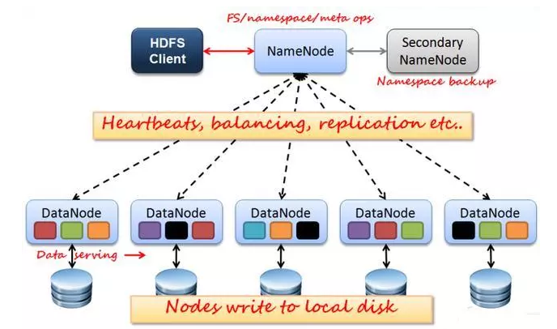
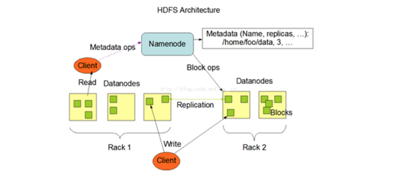
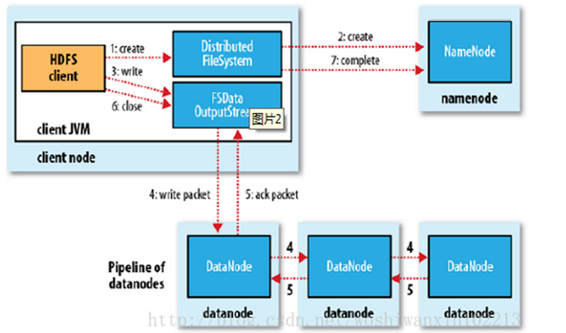
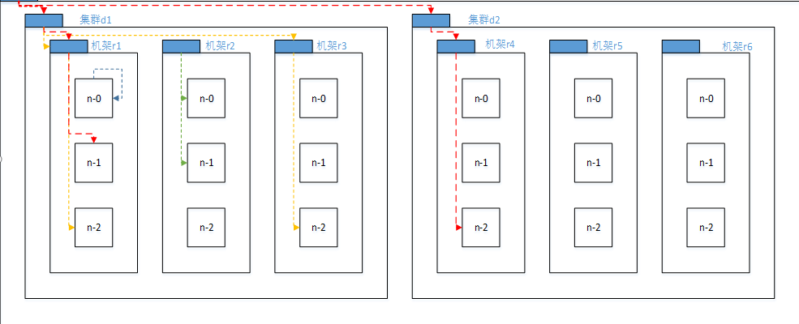
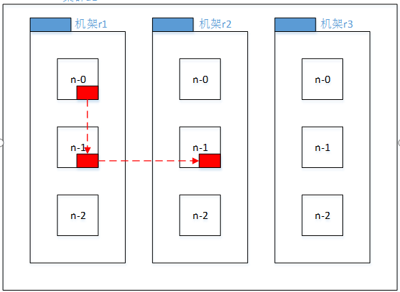
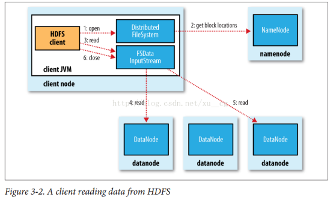
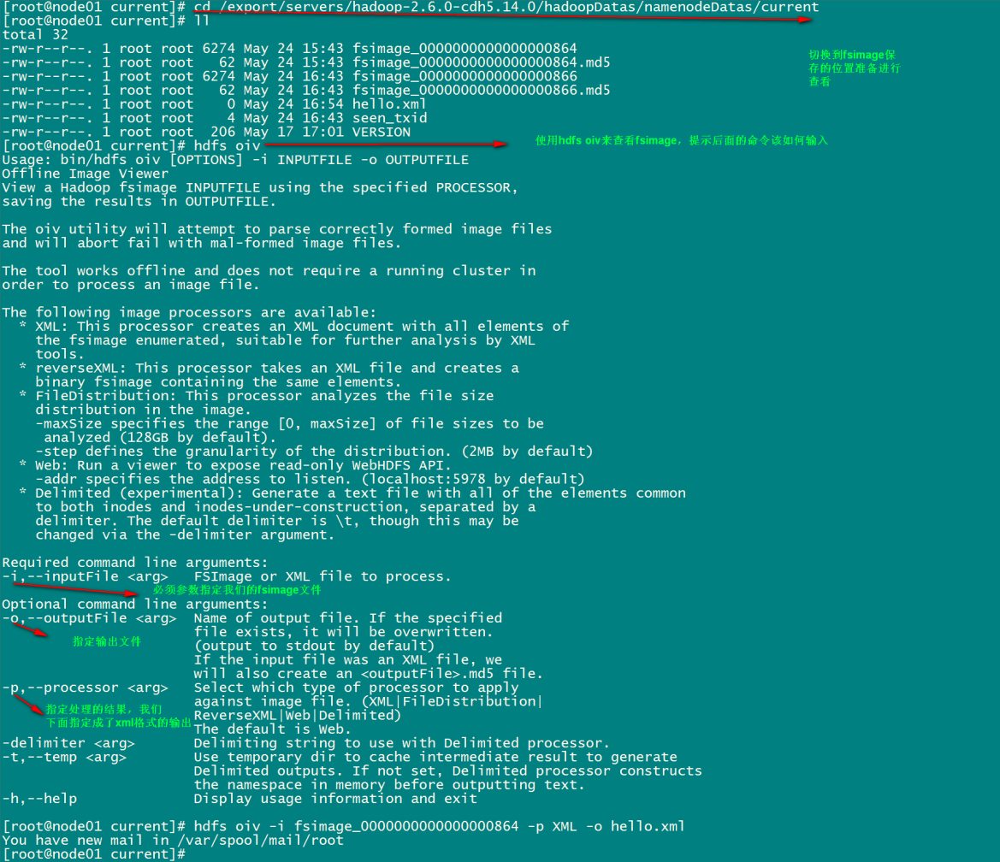
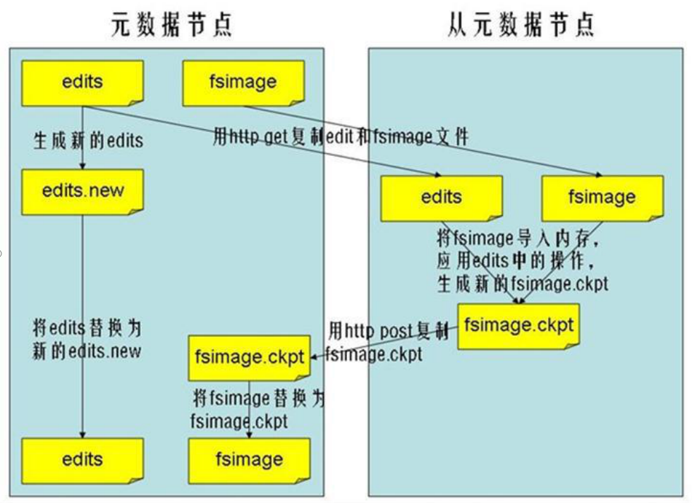
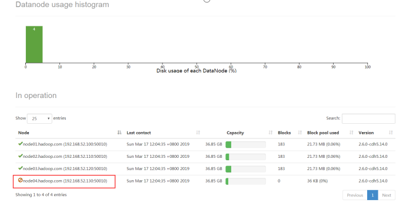

# Hadoop 核心-HDFS

## 1. HDFS概述

​	hadoop这个软件框架，首要的基础功能就是它是一个文件系统，在hadoop中使用FileSystem这个抽象类来表示我们的文件系统，这个抽象类下面有很多子实现类，究竟使用哪一种，需要看我们具体的实现类，在我们实际工作中，用到的最多的就是HDFS(分布式文件系统)以及LocalFileSystem(本地文件系统)了

 	在现代的企业环境中，单机容量往往无法存储大量数据，需要跨机器存储。统一管理分布在集群上的文件系统称为[分布式文件系统]() 。

​     [HDFS]()（Hadoop  Distributed  File  System）是 Apache Hadoop 项目的一个子项目.是ha doop的核心组件之一,  Hadoop 非常适于存储大型数据 (比如 TB 和 PB), 其就是使用 HDFS 作为存储系统. HDFS 使用多台计算机存储文件, 并且提供统一的访问接口, 像是访问一个普通文件系统一样使用分布式文件系统. 


## 2. HDFS 的架构

​	

	



* HDFS是一个主/从（Mater/Slave）体系结构, 由三部分组成: NameNode和DataNode以及SecondaryNamenode
  * NameNode负责管理整个文件系统的元数据，以及每一个路径（文件）所对应的数据块信息
  * DataNode 负责管理用户的文件数据块，每一个数据块都可以在多个datanode上存储多个副本 3
  * Secondary NameNode用来监控HDFS状态的辅助后台程序，每隔一段时间获取HDFS元数据的快照。最主要作用是辅助namenode管理元数据信息


## 3. HDFS的特性

​	首先，它是一个文件系统，用于存储文件，通过统一的命名空间目录树来定位文件； 

​	其次，它是分布式的，由很多服务器联合起来实现其功能，集群中的服务器有各自的角色。 

* 1) master/slave 架构

```
	HDFS 采用 master/slave 架构。一般一个 HDFS 集群是有一个 Namenode 和一定数目的Datanode 组成。Namenode 是 HDFS 集群主节点，Datanode 是 HDFS 集群从节点，两种角色各司其职，共同协调完成分布式的文件存储服务。 
```

* 2) 分块存储

```
	HDFS 中的文件在物理上是分块存储（block）的，块的大小可以通过配置参数来规定，默认大小在 hadoop2.x 版本中是 128M。
```

* 3) 名字空间（NameSpace）

```
	HDFS 支持传统的层次型文件组织结构。用户或者应用程序可以创建目录，然后将文件保存在这些目录里。文件系统名字空间的层次结构和大多数现有的文件系统类似：用户可以创建、删除、移动或重命名文件。 
	Namenode 负责维护文件系统的名字空间，任何对文件系统名字空间或属性的修改都将被Namenode 记录下来。 
	HDFS 会给客户端提供一个统一的抽象目录树，客户端通过路径来访问文件，形如：hdfs://namenode:port/dir-a/dir-b/dir-c/file.data。
```

* 4) Namenode 元数据管理

```
	我们把目录结构及文件分块位置信息叫做元数据。Namenode 负责维护整个hdfs文件系统的目录树结构，以及每一个文件所对应的 block 块信息（block 的id，及所在的datanode 服务器）。
```

* 5) Datanode 数据存储

```
	文件的各个 block 的具体存储管理由 datanode 节点承担。每一个 block 都可以在多个datanode 上。Datanode 需要定时向 Namenode 汇报自己持有的 block信息。 存储多个副本（副本数量也可以通过参数设置 dfs.replication，默认是 3）
```

* 6) 副本机制

```
	为了容错，文件的所有 block 都会有副本。每个文件的 block 大小和副本系数都是可配置的。应用程序可以指定某个文件的副本数目。副本系数可以在文件创建的时候指定，也可以在之后改变。
```

* 7) 一次写入，多次读出 

```
	HDFS 是设计成适应一次写入，多次读出的场景，且不支持文件的修改。 
	正因为如此，HDFS 适合用来做大数据分析的底层存储服务，并不适合用来做.网盘等应用，因为，修改不方便，延迟大，网络开销大，成本太高
```

## 4、hdfs的命令行使用

help

```
格式:  hdfs dfs -help 操作命令
作用: 查看某一个操作命令的参数信息
```

ls 

~~~shell
格式：  hdfs dfs -ls  URI
作用：类似于Linux的ls命令，显示文件列表
~~~

~~~shell
 hdfs  dfs   -ls  /
~~~

lsr  

~~~shell
格式  :   hdfs  dfs -lsr URI
作用  : 在整个目录下递归执行ls, 与UNIX中的ls-R类似
~~~

~~~shell
 hdfs  dfs   -lsr  /
~~~

mkdir 

~~~shell
格式 ： hdfs  dfs  -mkdir [-p] <paths>
作用 :   以<paths>中的URI作为参数，创建目录。使用-p参数可以递归创建目录
~~~

put

~~~shell
格式   ： hdfs dfs -put <localsrc >  ... <dst>
作用 ：  将单个的源文件src或者多个源文件srcs从本地文件系统拷贝到目标文件系统中（<dst>对应的路径）。也可以从标准输入中读取输入，写入目标文件系统中
~~~

~~~shell
hdfs dfs -put  /rooot/a.txt  /dir1
~~~

moveFromLocal

~~~shell
格式： hdfs  dfs -moveFromLocal  <localsrc>   <dst>
作用:  和put命令类似，但是源文件localsrc拷贝之后自身被删除
~~~

~~~shell
hdfs  dfs -moveFromLocal  /root/install.log  /
~~~

copyFromLocal

```
格式:  hdfs dfs -copyFromLocal <localsrc> ... <dst>
作用: 从本地文件系统中拷贝文件到hdfs路径去
```

appendToFile

```shell
格式: hdfs dfs -appendToFile <localsrc> ... <dst>
作用: 追加一个或者多个文件到hdfs指定文件中.也可以从命令行读取输入.
```

```shell
 hdfs dfs -appendToFile  a.xml b.xml  /big.xml
```

moveToLocal  

~~~shell
未实现
~~~

get

~~~shell
格式   hdfs dfs  -get [-ignorecrc ]  [-crc]  <src> <localdst>

作用：将文件拷贝到本地文件系统。 CRC 校验失败的文件通过-ignorecrc选项拷贝。 文件和CRC校验可以通过-CRC选项拷贝
~~~

```shell
hdfs dfs  -get   /install.log  /export/servers
```

getmerge 

```
格式: hdfs dfs -getmerge <src> <localdst>
作用: 合并下载多个文件，比如hdfs的目录 /aaa/下有多个文件:log.1, log.2,log.3,...
```

copyToLocal

```
格式:  hdfs dfs -copyToLocal <src> ... <localdst>
作用:  从hdfs拷贝到本地
```

mv

~~~shell
格式  ： hdfs  dfs -mv URI   <dest>
作用： 将hdfs上的文件从原路径移动到目标路径（移动之后文件删除），该命令不能夸文件系统
~~~

~~~shell
hdfs  dfs  -mv  /dir1/a.txt   /dir2
~~~

rm

~~~she
格式： hdfs dfs -rm [-r] 【-skipTrash】 URI 【URI 。。。】
作用：   删除参数指定的文件，参数可以有多个。   此命令只删除文件和非空目录。
如果指定-skipTrash选项，那么在回收站可用的情况下，该选项将跳过回收站而直接删除文件；
否则，在回收站可用时，在HDFS Shell 中执行此命令，会将文件暂时放到回收站中。
~~~

~~~shell
hdfs  dfs  -rm  -r  /dir1
~~~

cp

~~~shell
格式:     hdfs  dfs  -cp URI [URI ...] <dest>
作用：    将文件拷贝到目标路径中。如果<dest>  为目录的话，可以将多个文件拷贝到该目录下。
-f
选项将覆盖目标，如果它已经存在。
-p
选项将保留文件属性（时间戳、所有权、许可、ACL、XAttr）。
~~~

~~~shell
hdfs dfs -cp /dir1/a.txt  /dir2/b.txt
~~~

cat  

~~~shell
hdfs dfs  -cat  URI [uri  ...]
作用：将参数所指示的文件内容输出到stdout
~~~

~~~shell
hdfs dfs  -cat /install.log
~~~

tail

```
格式: hdfs dfs -tail path
作用: 显示一个文件的末尾
```

text

```
格式:hdfs dfs -text path
作用: 以字符形式打印一个文件的内容
```

chmod  

~~~shell
格式:      hdfs   dfs  -chmod  [-R]  URI[URI  ...]
作用：    改变文件权限。如果使用  -R 选项，则对整个目录有效递归执行。使用这一命令的用户必须是文件的所属用户，或者超级用户。
~~~

~~~shell
hdfs dfs -chmod -R 777 /install.log
~~~

chown   

~~~shell
格式:      hdfs   dfs  -chmod  [-R]  URI[URI  ...]
作用：    改变文件的所属用户和用户组。如果使用  -R 选项，则对整个目录有效递归执行。使用这一命令的用户必须是文件的所属用户，或者超级用户。
~~~

~~~shell
hdfs  dfs  -chown  -R hadoop:hadoop  /install.log
~~~

df

```
格式: hdfs dfs  -df  -h  path
作用: 统计文件系统的可用空间信息
```

du

```
格式: hdfs dfs -du -s -h path
作用: 统计文件夹的大小信息
```

count

```
格式: hdfs dfs -count path
作用: 统计一个指定目录下的文件节点数量
```

setrep

```
格式:  hdfs dfs -setrep num filePath
作用: 设置hdfs中文件的副本数量
	注意: 即使设置的超过了datanode的数量,副本的数量也最多只能和datanode的数量是一致的
```

expunge (不要用)

```
格式:  hdfs dfs  -expunge
作用: 清空hdfs垃圾桶 
```


## 5、hdfs的高级使用命令

### 5. 1、HDFS文件限额配置

​	 在多人共用HDFS的环境下，配置设置非常重要。特别是在Hadoop处理大量资料的环境，如果没有配额管理，很容易把所有的空间用完造成别人无法存取。Hdfs的配额设定是针对目录而不是针对账号，可以 让每个账号仅操作某一个目录，然后对目录设置配置。 

​    hdfs文件的限额配置允许我们以文件个数，或者文件大小来限制我们在某个目录下上传的文件数量或者文件内容总量，以便达到我们类似百度网盘网盘等限制每个用户允许上传的最大的文件的量。

~~~shell
 hdfs dfs -count -q -h /user/root/dir1  #查看配额信息
~~~


#### 5.1.1、数量限额

~~~shell
hdfs dfs  -mkdir -p /user/root/dir    #创建hdfs文件夹
hdfs dfsadmin -setQuota 2  dir      # 给该文件夹下面设置最多上传两个文件，发现只能上传一个文件
~~~

~~~shell
hdfs dfsadmin -clrQuota /user/root/dir  # 清除文件数量限制
~~~

#### 5.1.2、空间**大小限额**

 在设置空间配额时，设置的空间至少是block_size * 3大小

~~~shell
hdfs dfsadmin -setSpaceQuota 4k /user/root/dir   # 限制空间大小4KB
hdfs dfs -put  /root/a.txt  /user/root/dir 
~~~

生成任意大小文件的命令:

~~~shell
dd if=/dev/zero of=1.txt  bs=1M count=2     #生成2M的文件
~~~

清除空间配额限制

~~~shell
hdfs dfsadmin -clrSpaceQuota /user/root/dir
~~~


### 5.2、hdfs的安全模式

​	安全模式是hadoop的一种[保护机制]()，用于保证集群中的数据块的安全性。当集群启动的时候，会首先进入安全模式。当系统处于安全模式时会检查数据块的完整性。

假设我们设置的副本数（即参数dfs.replication）是3，那么在datanode上就应该有3个副本存在，假设只存在2个副本，那么比例就是2/3=0.666。hdfs默认的副本率0.999。我们的副本率0.666明显小于0.999，因此系统会自动的复制副本到其他dataNode，使得副本率不小于0.999。如果系统中有5个副本，超过我们设定的3个副本，那么系统也会删除多于的2个副本。 

[在安全模式状态下，文件系统只接受读数据请求，而不接受删除、修改等变更请求]()。在，当整个系统达到安全标准时，HDFS自动离开安全模式。30s

安全模式操作命令

~~~shell
    hdfs  dfsadmin  -safemode  get #查看安全模式状态
    hdfs  dfsadmin  -safemode  enter #进入安全模式
    hdfs  dfsadmin  -safemode  leave #离开安全模式
~~~

## 6. hdfs的block块和副本机制

​	hdfs将所有的文件全部抽象成为block块来进行存储，不管文件大小，全部一视同仁都是以block块的统一大小和形式进行存储，方便我们的分布式文件系统对文件的管理

​	所有的文件都是以block块的方式存放在HDFS文件系统当中，在hadoop1当中，文件的block块默认大小是64M，hadoop2当中，文件的block块大小默认是128M，block块的大小可以通过hdfs-site.xml当中的配置文件进行指定

```xml
    <property>
        <name>dfs.block.size</name>
        <value>块大小 以字节为单位</value>//只写数值就可以
    </property>
```

### 6.1 抽象为block块的好处

* 1)  一个文件有可能大于集群中任意一个磁盘 
  ​	10T*3/128 = xxx块 2T，2T，2T 文件方式存—–>多个block块，这些block块属于一个文件

* 2) 使用块抽象而不是文件可以简化存储子系统

* 3) 块非常适合用于数据备份进而提供数据容错能力和可用性

### 6.2 块缓存

​	通常DataNode从磁盘中读取块，但对于访问频繁的文件，其对应的块可能被显示的缓存在DataNode的内存中，以堆外块缓存的形式存在。默认情况下，一个块仅缓存在一个DataNode的内存中，当然可以针对每个文件配置DataNode的数量。作业调度器通过在缓存块的DataNode上运行任务，可以利用块缓存的优势提高读操作的性能。

例如： 
​	连接（join）操作中使用的一个小的查询表就是块缓存的一个很好的候选。 用户或应用通过在缓存池中增加一个cache directive来告诉namenode需要缓存哪些文件及存多久。缓存池（cache pool）是一个拥有管理缓存权限和资源使用的管理性分组。

例如:

​	一个文件 130M，会被切分成2个block块，保存在两个block块里面，实际占用磁盘130M空间，而不是占用256M的磁盘空间

### 6.3 hdfs的文件权限验证

​	hdfs的文件权限机制与linux系统的文件权限机制类似

​	r:read   w:write  x:execute  权限x对于文件表示忽略，对于文件夹表示是否有权限访问其内容

​	如果linux系统用户zhangsan使用hadoop命令创建一个文件，那么这个文件在HDFS当中的owner就是zhangsan

​	HDFS文件权限的目的，防止好人做错事，而不是阻止坏人做坏事。HDFS相信你告诉我你是谁，你就是谁

### 6.4 hdfs的副本因子

​	为了保证block块的安全性，也就是数据的安全性，在hadoop2当中，文件默认保存三个副本，我们可以更改副本数以提高数据的安全性

​	在hdfs-site.xml当中修改以下配置属性，即可更改文件的副本数

```xml
		<property>
                <name>dfs.replication</name>
                <value>3</value>
        </property>
```


## 7.HDFS 文件写入过程

 

* 1) Client 发起文件上传请求, 通过 RPC 与 NameNode 建立通讯, NameNode 检查目标文件是否已存在, 父目录是否存在, 返回是否可以上传

* 2) Client 请求第一个 block 该传输到哪些 DataNode 服务器上

* 3) NameNode 根据配置文件中指定的备份数量及机架感知原理进行文件分配, 返回可用的 DataNode 的地址如: A, B, C
  * Hadoop 在设计时考虑到数据的安全与高效, 数据文件默认在 HDFS 上存放三份, 存储策略为本地一份, 同机架内其它某一节点上一份, 不同机架的某一节点上一份。

* 4) Client 请求 3 台 DataNode 中的一台 A 上传数据（本质上是一个 RPC 调用，建立 pipeline ）, A 收到请求会继续调用 B, 然后 B 调用 C, 将整个 pipeline 建立完成, 后逐级返回 client

* 5) Client 开始往 A 上传第一个 block（先从磁盘读取数据放到一个本地内存缓存）, 以 packet 为单位（默认64K）, A 收到一个 packet 就会传给 B, B 传给 C. A 每传一个 packet 会放入一个应答队列等待应答

* 6) 数据被分割成一个个 packet 数据包在 pipeline 上依次传输, 在 pipeline 反方向上, 逐个发送 ack（命令正确应答）, 最终由 pipeline 中第一个 DataNode 节点 A 将 pipelineack 发送给 Client

* 7) 当一个 block 传输完成之后, Client 再次请求 NameNode 上传第二个 block 到服务 1

###  7.1 网络拓扑概念

​	在本地网络中，两个节点被称为“彼此近邻”是什么意思？在海量数据处理中，其主要限制因素是节点之间数据的传输速率——带宽很稀缺。这里的想法是将两个节点间的带宽作为距离的衡量标准。

​	节点距离：两个节点到达最近的共同祖先的距离总和。

​	例如，假设有数据中心d1机架r1中的节点n1。该节点可以表示为/d1/r1/n1。利用这种标记，这里给出四种距离描述。

​	Distance(/d1/r1/n1, /d1/r1/n1)=0（同一节点上的进程）

​	Distance(/d1/r1/n1, /d1/r1/n2)=2（同一机架上的不同节点）

​	Distance(/d1/r1/n1, /d1/r3/n2)=4（同一数据中心不同机架上的节点）

​	Distance(/d1/r1/n1, /d2/r4/n2)=6（不同数据中心的节点）



### 7.2 机架感知（副本节点选择）

1）官方ip地址：

<http://hadoop.apache.org/docs/r2.7.3/hadoop-project-dist/hadoop-common/RackAwareness.html>

http://hadoop.apache.org/docs/r2.7.3/hadoop-project-dist/hadoop-hdfs/HdfsDesign.html#Data_Replication

2）低版本Hadoop副本节点选择

​	第一个副本在client所处的节点上。如果客户端在集群外，随机选一个。

​	第二个副本和第一个副本位于不相同机架的随机节点上。

​	第三个副本和第二个副本位于相同机架，节点随机。


3)  Hadoop2.7.2副本节点选择

​	第一个副本在client所处的节点上。如果客户端在集群外，随机选一个。

​	第二个副本和第一个副本位于相同机架，随机节点。

​	第三个副本位于不同机架，随机节点。



## 8.HDFS 文件读取过程	

	

1. Client向NameNode发起RPC请求，来确定请求文件block所在的位置；
2. NameNode会视情况返回文件的部分或者全部block列表，对于每个block，NameNode 都会返回含有该 block 副本的 DataNode 地址；  这些返回的 DN 地址，会按照集群拓扑结构得出 DataNode 与客户端的距离，然后进行排序，排序两个规则：网络拓扑结构中距离 Client 近的排靠前；心跳机制中超时汇报的 DN 状态为 STALE，这样的排靠后；
3. Client 选取排序靠前的 DataNode 来读取 block，如果客户端本身就是DataNode,那么将从本地直接获取数据(短路读取特性)；
4. 底层上本质是建立 Socket Stream（FSDataInputStream），重复的调用父类 DataInputStream 的 read 方法，直到这个块上的数据读取完毕；
5. 当读完列表的 block 后，若文件读取还没有结束，客户端会继续向NameNode 获取下一批的 block 列表；
6. 读取完一个 block 都会进行 checksum 验证，如果读取 DataNode 时出现错误，客户端会通知 NameNode，然后再从下一个拥有该 block 副本的DataNode 继续读。
7. read 方法是并行的读取 block 信息，不是一块一块的读取；NameNode 只是返回Client请求包含块的DataNode地址，并不是返回请求块的数据；
8. 最终读取来所有的 block 会合并成一个完整的最终文件。

## 9. nameNode工作机制以及元数据管理


### 9.1 namenode与datanode启动

【namenode工作机制】

```
 1) 第一次启动namenode格式化后，创建fsimage和edits文件。如果不是第一次启动，直接加载编辑日志和镜像文件到内存。
 2) 客户端对元数据进行增删改的请求
 3) namenode记录操作日志，更新滚动日志。
 4) namenode在内存中对数据进行增删改查
```

【Secondary NameNode】

```
 1) Secondary NameNode询问namenode是否需要checkpoint。直接带回namenode是否检查结果。
 2) Secondary NameNode请求执行checkpoint。
 3) namenode滚动正在写的edits日志
 4) 将滚动前的编辑日志和镜像文件拷贝到Secondary NameNode
 5) Secondary NameNode加载编辑日志和镜像文件到内存，并合并。
 6) 生成新的镜像文件fsimage.chkpoint
 7) 拷贝fsimage.chkpoint到namenode
namenode将fsimage.chkpoint重新命名成fsimage
```

### 9.2 FSImage与edits详解

​	所有的元数据信息都保存在了FsImage与Eidts文件当中，这两个文件就记录了所有的数据的元数据信息，元数据信息的保存目录配置在了hdfs-site.xml当中

```xml
		<!--fsimage文件存储的路径-->
		<property>
                <name>dfs.namenode.name.dir</name>
                <value>file:///export/servers/hadoop-2.6.0-cdh5.14.0/hadoopDatas/namenodeDatas</value>
        </property>
        <!-- edits文件存储的路径 -->
		<property>
                <name>dfs.namenode.edits.dir</name>
                <value>file:///export/servers/hadoop-2.6.0-cdh5.14.0/hadoopDatas/dfs/nn/edits</value>
  		</property>
```

​	客户端对hdfs进行写文件时会首先被记录在edits文件中。

​	edits修改时元数据也会更新。

​	每次hdfs更新时edits先更新后客户端才会看到最新信息。

​	fsimage:是namenode中关于元数据的镜像，一般称为检查点。

​	一般开始时对namenode的操作都放在edits中，为什么不放在fsimage中呢？

​		因为fsimage是namenode的完整的镜像，内容很大，如果每次都加载到内存的话生成树状拓扑结构，这是非常耗内存和CPU。

​	fsimage内容包含了namenode管理下的所有datanode中文件及文件block及block所在的datanode的元数据信息。随着edits内容增大，就需要在一定时间点和fsimage合并。

### 9.3 FSimage文件当中的文件信息查看

官方查看文档

<http://archive.cloudera.com/cdh5/cdh/5/hadoop-2.6.0-cdh5.14.0/hadoop-project-dist/hadoop-hdfs/HdfsImageViewer.html>

【使用命令 hdfs  oiv】

```
cd  /export/servers/hadoop-2.6.0-cdh5.14.0/hadoopDatas/namenodeDatas/current
hdfs oiv -i fsimage_0000000000000000864 -p XML -o hello.xml
```



### 9.4 edits当中的文件信息查看

官方查看文档

<http://archive.cloudera.com/cdh5/cdh/5/hadoop-2.6.0-cdh5.14.0/hadoop-project-dist/hadoop-hdfs/HdfsEditsViewer.html>

【查看命令 hdfs  oev】

```
cd  /export/servers/hadoop-2.6.0-cdh5.14.0/hadoopDatas/dfs/nn/edits
hdfs oev -i  edits_0000000000000000865-0000000000000000866 -o myedit.xml -p XML
```

### 9.5 secondarynameNode如何辅助管理FSImage与Edits文件

```
5.1) secnonaryNN通知NameNode切换editlog
5.2) secondaryNN从NameNode中获得FSImage和editlog(通过http方式)
5.3) secondaryNN将FSImage载入内存，然后开始合并editlog，合并之后成为新的fsimage
5.4) secondaryNN将新的fsimage发回给NameNode
5.5) NameNode用新的fsimage替换旧的fsimage
```



​	完成合并的是secondarynamenode，会请求namenode停止使用edits,暂时将新写操作放入一个新的文件中（edits.new)。secondarynamenode从namenode中通过http get获得edits，因为要和fsimage合并，所以也是通过http get 的方式把fsimage加载到内存，然后逐一执行具体对文件系统的操作，与fsimage合并，生成新的fsimage，然后把fsimage发送给namenode，通过http post的方式。

​	namenode从secondarynamenode获得了fsimage后会把原有的fsimage替换为新的fsimage,把edits.new变成edits。同时会更新fsimage。

​	hadoop进入安全模式时需要管理员使用dfsadmin的save namespace来创建新的检查点。

​	secondarynamenode在合并edits和fsimage时需要消耗的内存和namenode差不多，所以一般把namenode和secondarynamenode放在不同的机器上。

​	fsimage与edits的合并时机取决于两个参数，第一个参数是默认1小时fsimage与edits合并一次。

【第一个参数：时间达到一个小时fsimage与edits就会进行合并】

```
dfs.namenode.checkpoint.period     3600
```

【第二个参数：hdfs操作达到1000000次也会进行合并】

```
dfs.namenode.checkpoint.txns       1000000
```

还有一个参数是每隔多长时间检查一次hdfs的操作次数

```
dfs.namenode.checkpoint.check.period   60
```

### 9.6 namenode元数据信息多目录配置

​	为了保证元数据的安全性，我们一般都是先确定好我们的磁盘挂载目录，将元数据的磁盘做RAID1

​	namenode的本地目录可以配置成多个，且每个目录存放内容相同，增加了可靠性。

* 具体配置方案:

  【hdfs-site.xml】

```
	<property>
         <name>dfs.namenode.name.dir</name>
         <value>file:///export/servers/hadoop-2.6.0-cdh5.14.0/hadoopDatas/namenodeDatas</value>
    </property>
```

### 9.7 namenode故障恢复

​	在我们的secondaryNamenode对namenode当中的fsimage和edits进行合并的时候，每次都会先将namenode的fsimage与edits文件拷贝一份过来，所以fsimage与edits文件在secondarNamendoe当中也会保存有一份，如果namenode的fsimage与edits文件损坏，那么我们可以将secondaryNamenode当中的fsimage与edits拷贝过去给namenode继续使用，只不过有可能会丢失一部分数据。这里涉及到几个配置选项

【namenode保存fsimage的配置路径】

```
<!--  namenode元数据存储路径，实际工作当中一般使用SSD固态硬盘，并使用多个固态硬盘隔开，冗余元数据 -->
	<property>
		<name>dfs.namenode.name.dir</name>
		<value>file:///export/servers/hadoop-2.6.0-cdh5.14.0/hadoopDatas/namenodeDatas</value>
	</property>
```

【namenode保存edits文件的配置路径】

```
<property>
		<name>dfs.namenode.edits.dir</name>
		<value>file:///export/servers/hadoop-2.6.0-cdh5.14.0/hadoopDatas/dfs/nn/edits</value>
</property>
```

【secondaryNamenode保存fsimage文件的配置路径】

```
<property>
		<name>dfs.namenode.checkpoint.dir</name>
		<value>file:///export/servers/hadoop-2.6.0-cdh5.14.0/hadoopDatas/dfs/snn/name</value>
</property>
```

【secondaryNamenode保存edits文件的配置路径】

```
<property>
		<name>dfs.namenode.checkpoint.edits.dir</name>
		<value>file:///export/servers/hadoop-2.6.0-cdh5.14.0/hadoopDatas/dfs/nn/snn/edits</value>
</property>
```

​	接下来我们来模拟namenode的故障恢复功能

* 1) 杀死namenode进程: 使用jps查看namenode的进程号 , kill -9 直接杀死

* 2) 删除namenode的fsimage文件和edits文件
  * 根据上述配置, 找到namenode放置fsimage和edits路径. 直接全部rm -rf 删除

* 3) 拷贝secondaryNamenode的fsimage与edits文件到namenode的fsimage与edits文件夹下面去
  * 根据上述配置, 找到secondaryNamenode的fsimage和edits路径, 将内容 使用cp -r 全部复制到namenode对应的目录下即可

* 4) 重新启动namenode, 观察数据是否存在

## 10 datanode工作机制以及数据存储

* 1 datanode工作机制

```
	1）一个数据块在datanode上以文件形式存储在磁盘上，包括两个文件，一个是数据本身，一个是元数据包括数据块的长度，块数据的校验和，以及时间戳。
	
	2）DataNode启动后向namenode注册，通过后，周期性（1小时）的向namenode上报所有的块信息。(dfs.blockreport.intervalMsec)
	
	3）心跳是每3秒一次，心跳返回结果带有namenode给该datanode的命令如复制块数据到另一台机器，或删除某个数据块。如果超过10分钟没有收到某个datanode的心跳，则认为该节点不可用。
	
	4）集群运行中可以安全加入和退出一些机器
```

* 2 数据完整性

```
2.1）当DataNode读取block的时候，它会计算checksum
2.2）如果计算后的checksum，与block创建时值不一样，说明block已经损坏。
2.3）client读取其他DataNode上的block.
2.4）datanode在其文件创建后周期验证checksum
```

* 3) 掉线时限参数设置

```
	datanode进程死亡或者网络故障造成datanode无法与namenode通信，namenode不会立即把该节点判定为死亡，要经过一段时间，这段时间暂称作超时时长。HDFS默认的超时时长为10分钟+30秒。如果定义超时时间为timeout，则超时时长的计算公式为：
	timeout  = 2 * dfs.namenode.heartbeat.recheck-interval + 10 * dfs.heartbeat.interval。
	而默认的dfs.namenode.heartbeat.recheck-interval 大小为5分钟，dfs.heartbeat.interval默认为3秒。
	需要注意的是hdfs-site.xml 配置文件中的heartbeat.recheck.interval的单位为毫秒，dfs.heartbeat.interval的单位为秒。
```

```xml
<property>
    <name>dfs.namenode.heartbeat.recheck-interval</name>
    <value>300000</value>
</property>
<property>
    <name>dfs.heartbeat.interval </name>
    <value>3</value>
</property>
```

* 4) DataNode的目录结构

  和namenode不同的是，datanode的存储目录是初始阶段自动创建的，不需要额外格式化。

```
在/export/servers/hadoop-2.6.0-cdh5.14.0/hadoopDatas/datanodeDatas/current这个目录下查看版本号
[root@node01 current]# cat VERSION 
    #Thu Mar 14 07:58:46 CST 2019
    storageID=DS-47bcc6d5-c9b7-4c88-9cc8-6154b8a2bf39
    clusterID=CID-dac2e9fa-65d2-4963-a7b5-bb4d0280d3f4
    cTime=0
    datanodeUuid=c44514a0-9ed6-4642-b3a8-5af79f03d7a4
    storageType=DATA_NODE
    layoutVersion=-56
```

具体解释:

​	storageID：存储id号

​	clusterID集群id，全局唯一

​	cTime属性标记了datanode存储系统的创建时间，对于刚刚格式化的存储系统，这个属性为0；但是在文件系统升级之后，该值会更新到新的时间戳。

​	datanodeUuid：datanode的唯一识别码

​	storageType：存储类型

​	layoutVersion是一个负整数。通常只有HDFS增加新特性时才会更新这个版本号。

* 5) datanode多目录配置

  * datanode也可以配置成多个目录，每个目录存储的数据不一样。即：数据不是副本。具体配置如下：
    * 只需要在value中使用逗号分隔出多个存储目录即可

  ```
  cd /export/servers/hadoop-2.6.0-cdh5.14.0/etc/hadoop
  <!--  定义dataNode数据存储的节点位置，实际工作中，一般先确定磁盘的挂载目录，然后多个目录用，进行分割  -->
          <property>
                  <name>dfs.datanode.data.dir</name>
                  <value>file:///export/servers/hadoop-2.6.0-cdh5.14.0/hadoopDatas/datanodeDatas</value>
          </property>
  ```


### 10.1 服役新数据节点

需求说明:

​	随着公司业务的增长，数据量越来越大，原有的数据节点的容量已经不能满足存储数据的需求，需要在原有集群基础上动态添加新的数据节点。

#### 10.1.1 环境准备

* 1) 复制一台新的虚拟机出来

```
将我们纯净的虚拟机复制一台出来，作为我们新的节点	
```

* 2) 修改mac地址以及IP地址

```
修改mac地址命令
	vim /etc/udev/rules.d/70-persistent-net.rules
修改ip地址命令
	vim /etc/sysconfig/network-scripts/ifcfg-eth0
```

* 3) 关闭防火墙，关闭selinux

```
关闭防火墙
	service iptables stop
关闭selinux
	vim /etc/selinux/config
```

* 4) 更改主机名

```
更改主机名命令，将node04主机名更改为node04.hadoop.com
vim /etc/sysconfig/network
```

* 5) 四台机器更改主机名与IP地址映射

```
四台机器都要添加hosts文件
vim /etc/hosts

192.168.52.100 node01.hadoop.com  node01
192.168.52.110 node02.hadoop.com  node02
192.168.52.120 node03.hadoop.com  node03
192.168.52.130 node04.hadoop.com  node04
```

* 6) node04服务器关机重启

```
node04执行以下命令关机重启
	reboot -h now
```

* 7）node04安装jdk

```
node04统一两个路径
	mkdir -p /export/softwares/
	mkdir -p /export/servers/
```

​	然后解压jdk安装包，配置环境变量

* 8) 解压hadoop安装包

```
在node04服务器上面解压hadoop安装包到/export/servers , node01执行以下命令将hadoop安装包拷贝到node04服务器
	cd /export/softwares/
	scp hadoop-2.6.0-cdh5.14.0-自己编译后的版本.tar.gz node04:$PWD

node04解压安装包
	tar -zxf hadoop-2.6.0-cdh5.14.0-自己编译后的版本.tar.gz -C /export/servers/
```

* 9) 将node01关于hadoop的配置文件全部拷贝到node04

```
node01执行以下命令，将hadoop的配置文件全部拷贝到node04服务器上面
	cd /export/servers/hadoop-2.6.0-cdh5.14.0/etc/hadoop/
	scp ./* node04:$PWD
```

#### 10.1.2 服役新节点具体步骤

* 1) 创建dfs.hosts文件

```shell
在node01也就是namenode所在的机器的/export/servers/hadoop-2.6.0-cdh5.14.0/etc/hadoop目录下创建dfs.hosts文件

[root@node01 hadoop]# cd /export/servers/hadoop-2.6.0-cdh5.14.0/etc/hadoop
[root@node01 hadoop]# touch dfs.hosts
[root@node01 hadoop]# vim dfs.hosts

添加如下主机名称（包含新服役的节点）
node01
node02
node03
node04
```

* 2) node01编辑hdfs-site.xml添加以下配置
  * 在namenode的hdfs-site.xml配置文件中增加dfs.hosts属性

```
node01执行以下命令 :

cd /export/servers/hadoop-2.6.0-cdh5.14.0/etc/hadoop
vim hdfs-site.xml

# 添加一下内容
	<property>
         <name>dfs.hosts</name>
         <value>/export/servers/hadoop-2.6.0-cdh5.14.0/etc/hadoop/dfs.hosts</value>
    </property>
    <!--动态上下线配置: 如果配置文件中有, 就不需要配置-->
    <property>
		<name>dfs.hosts</name>
		<value>/export/servers/hadoop-2.6.0-cdh5.14.0/etc/hadoop/accept_host</value>
	</property>
	
	<property>
		<name>dfs.hosts.exclude</name>
		<value>/export/servers/hadoop-2.6.0-cdh5.14.0/etc/hadoop/deny_host</value>
	</property>
```

* 3) 刷新namenode
  * node01执行以下命令刷新namenode

```
[root@node01 hadoop]# hdfs dfsadmin -refreshNodes
Refresh nodes successful
```

* 4) 更新resourceManager节点
  * node01执行以下命令刷新resourceManager

```
[root@node01 hadoop]# yarn rmadmin -refreshNodes
19/03/16 11:19:47 INFO client.RMProxy: Connecting to ResourceManager at node01/192.168.52.100:8033
```

* 5) namenode的slaves文件增加新服务节点主机名称
  * node01编辑slaves文件，并添加新增节点的主机，更改完后，slaves文件不需要分发到其他机器上面去

```
node01执行以下命令编辑slaves文件 :
	cd /export/servers/hadoop-2.6.0-cdh5.14.0/etc/hadoop
	vim slaves
	
添加一下内容: 	
node01
node02
node03
node04
```

* 6) 单独启动新增节点

```
node04服务器执行以下命令，启动datanode和nodemanager : 
	cd /export/servers/hadoop-2.6.0-cdh5.14.0/
	sbin/hadoop-daemon.sh start datanode
	sbin/yarn-daemon.sh start nodemanager
```

* 7) 浏览器查看

  * [http://node01:50070/dfshealth.html#tab-overview](#tab-overview)

    <http://node01:8088/cluster>

* 8) 使用负载均衡命令，让数据均匀负载所有机器

```
node01执行以下命令 : 
	cd /export/servers/hadoop-2.6.0-cdh5.14.0/
	sbin/start-balancer.sh
```

### 10.2 退役旧数据

* 1) 创建dfs.hosts.exclude配置文件

  在namenod所在服务器的/export/servers/hadoop-2.6.0-cdh5.14.0/etc/hadoop目录下创建dfs.hosts.exclude文件，并添加需要退役的主机名称

```
node01执行以下命令 : 
	cd /export/servers/hadoop-2.6.0-cdh5.14.0/etc/hadoop
	touch dfs.hosts.exclude
	vim dfs.hosts.exclude
添加以下内容:
	node04.hadoop.com

特别注意：该文件当中一定要写真正的主机名或者ip地址都行，不能写node04
```

* 2) 编辑namenode所在机器的hdfs-site.xml
  * 编辑namenode所在的机器的hdfs-site.xml配置文件，添加以下配置

```
cd /export/servers/hadoop-2.6.0-cdh5.14.0/etc/hadoop
vim hdfs-site.xml

#添加一下内容:
	<property>
         <name>dfs.hosts.exclude</name>
         <value>/export/servers/hadoop-2.6.0-cdh5.14.0/etc/hadoop/dfs.hosts.exclude</value>
   </property>
```

* 3)  刷新namenode，刷新resourceManager

```
在namenode所在的机器执行以下命令，刷新namenode，刷新resourceManager : 

hdfs dfsadmin -refreshNodes
yarn rmadmin -refreshNodes
```

* 4) 查看web浏览界面

  浏览器访问

  [http://node01:50070/dfshealth.html#tab-datanode](#tab-datanode)

  

* 5) 节点退役完成，停止该节点进程

  等待退役节点状态为decommissioned（所有块已经复制完成），停止该节点及节点资源管理器。注意：如果副本数是3，服役的节点小于等于3，是不能退役成功的，需要修改副本数后才能退役。


```
node04执行以下命令，停止该节点进程 : 
	cd /export/servers/hadoop-2.6.0-cdh5.14.0
	sbin/hadoop-daemon.sh stop datanode
	sbin/yarn-daemon.sh stop nodemanager
```

* 6) 从include文件中删除退役节点

```
namenode所在节点也就是node01执行以下命令删除退役节点 :
	cd /export/servers/hadoop-2.6.0-cdh5.14.0/etc/hadoop
	vim dfs.hosts
	
删除后的内容: 删除了node04
node01
node02
node03
```

* 7) node01执行一下命令刷新namenode，刷新resourceManager

```
hdfs dfsadmin -refreshNodes
yarn rmadmin -refreshNodes
```

* 8) 从namenode的slave文件中删除退役节点

```
namenode所在机器也就是node01执行以下命令从slaves文件中删除退役节点 : 
	cd /export/servers/hadoop-2.6.0-cdh5.14.0/etc/hadoop
	vim slaves
删除后的内容: 删除了 node04 
node01
node02
node03
```

* 9) 如果数据负载不均衡，执行以下命令进行均衡负载

```
node01执行以下命令进行均衡负载
	cd /export/servers/hadoop-2.6.0-cdh5.14.0/
	sbin/start-balancer.sh
```

## 11 block块手动拼接成为完整数据

​	所有的数据都是以一个个的block块存储的，只要我们能够将文件的所有block块全部找出来，拼接到一起，又会成为一个完整的文件，接下来我们就来通过命令将文件进行拼接:

* 1) 上传一个大于128M的文件到hdfs上面去

  我们选择一个大于128M的文件上传到hdfs上面去，只有一个大于128M的文件才会有多个block块

  这里我们选择将我们的jdk安装包上传到hdfs上面去

  node01执行以下命令上传jdk安装包

```
cd /export/softwares/
hdfs dfs -put jdk-8u141-linux-x64.tar.gz  /
```

* 2) web浏览器界面查看jdk的两个block块id

  这里我们看到两个block块id分别为

  1073742699和1073742700

  那么我们就可以通过blockid将我们两个block块进行手动拼接了


* 3) 根据我们的配置文件找到block块所在的路径

```
根据我们hdfs-site.xml的配置，找到datanode所在的路径
<!--  定义dataNode数据存储的节点位置，实际工作中，一般先确定磁盘的挂载目录，然后多个目录用，进行分割  -->
        <property>
                <name>dfs.datanode.data.dir</name>
                <value>file:///export/servers/hadoop-2.6.0-cdh5.14.0/hadoopDatas/datanodeDatas</value>
        </property>
        
        
进入到以下路径 : 此基础路径为 上述配置中value的路径
cd /export/servers/hadoop-2.6.0-cdh5.14.0/hadoopDatas/datanodeDatas/current/BP-557466926-192.168.52.100-1549868683602/current/finalized/subdir0/subdir3
```

* 4) 执行block块的拼接

```shell
将不同的各个block块按照顺序进行拼接起来，成为一个完整的文件
cat blk_1073742699 >> jdk8u141.tar.gz
cat blk_1073742700 >> jdk8u141.tar.gz
移动我们的jdk到/export路径，然后进行解压
mv  jdk8u141.tar.gz /export/
cd /export/
tar -zxf jdk8u141.tar.gz
正常解压，没有问题，说明我们的程序按照block块存储没有问题
```

