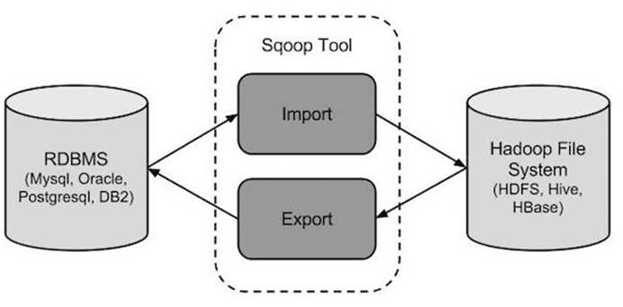

# 一、 Apache Sqoop

## 1． sqoop介绍 

**Apache Sqoop是在Hadoop生态体系和RDBMS体系之间传送数据的一种工具**。来自于Apache软件基金会提供。

Sqoop工作机制是将导入或导出命令翻译成mapreduce程序来实现。在翻译出的mapreduce中主要是对inputformat和outputformat进行定制。

Hadoop生态系统包括：HDFS、Hive、Hbase等

RDBMS体系包括：Mysql、Oracle、DB2等

Sqoop可以理解为：“SQL 到 Hadoop 和 Hadoop 到SQL”。



​    站在Apache立场看待数据流转问题，可以分为数据的导入导出:

Import：数据导入。RDBMS----->Hadoop

Export：数据导出。Hadoop---->RDBMS

 

## 2． sqoop安装

安装sqoop的前提是已经具备java和hadoop的环境。

使用版本： 1.4.6

配置文件修改：

cd $SQOOP_HOME/conf

mv sqoop-env-template.sh sqoop-env.sh

vi sqoop-env.sh

```shell
export HADOOP_COMMON_HOME= /export/servers/hadoop-2.7.5 

export HADOOP_MAPRED_HOME= /export/servers/hadoop-2.7.5

export HIVE_HOME= /export/servers/hive
```


加入mysql的jdbc驱动包

```shell
cp /hive/lib/mysql-connector-java-5.1.32.jar $SQOOP_HOME/lib/
```


验证启动

在sqoop安装目录执行：

```shell
bin/sqoop list-databases \

 --connect jdbc:mysql://localhost:3306/ \

 --username root --password hadoop
```

上述命令会列出所有mysql的数据库。

到这里，整个Sqoop安装工作完成。


 

# 二、 Sqoop导入

“导入工具”导入单个表从RDBMS到HDFS。表中的每一行被视为HDFS的记录。所有记录都存储为文本文件的文本数据

下面的语法用于将数据导入HDFS。

$ sqoop import (generic-args) (import-args)

Sqoop测试表数据

在mysql中创建数据库userdb，然后执行参考资料中的sql脚本：

创建三张表: **emp雇员表、 emp_add雇员地址表、emp_conn雇员联系表**。


 

 

## 1． 全量导入mysql表数据到HDFS

下面的命令用于从MySQL数据库服务器中的emp表导入HDFS。

```shell
bin/sqoop import \

--connect jdbc:mysql://192.168.109.1:3306/userdb \

--username root \

--password root \

--delete-target-dir \

--target-dir /sqoopresult \

--table emp --m 1
```


其中**--target-dir可以用来指定导出数据存放至HDFS的目录；**

**mysql jdbc url 请使用 ip 地址**。

 

为了验证在HDFS导入的数据，请使用以下命令查看导入的数据：

hdfs dfs -cat /sqoopresult/part-m-00000

可以看出它会在HDFS上默认用逗号,分隔emp表的数据和字段。可以通过

**--fields-terminated-by '\t'来指定分隔符**。

 ```shell
1201,gopal,manager,50000,TP
1202,manisha,Proof reader,50000,TP
1203,khalil,php dev,30000,AC
1204,prasanth,php dev,30000,AC
1205,kranthi,admin,20000,TP
 ```


## 2． 全量导入mysql表数据到HIVE

### 2.1． 方式一：先复制表结构到hive中再导入数据

将关系型数据的表结构复制到hive中

```shell
bin/sqoop create-hive-table \

--connect jdbc:mysql://192.168.109.1:3306/userdb \

--table emp_add \

--username root \

--password hadoop \

--hive-table test.emp_add_sp
```


其中：

 --table emp_add为mysql中的数据库sqoopdb中的表。   

 --hive-table emp_add_sp 为hive中新建的表名称。

 

从关系数据库导入文件到hive中

```shell
bin/sqoop import \

--connect jdbc:mysql://192.168.109.1:3306/userdb \

--username root \

--password root \

--table emp_add \

--hive-table test.emp_add_sp \

--hive-import \

--m 1
```

 

### 2.2． 方式二：直接复制表结构数据到hive中

 

```shell
bin/sqoop import \

--connect jdbc:mysql://192.168.109.1:3306/userdb \

--username root \

--password root \

--table emp_conn \

--hive-import \

--m 1 \

--hive-database test;
```


 

 

## 3． 导入表数据子集(where过滤)

--where 可以指定从关系数据库导入数据时的查询条件。它执行在数据库服务器相应的SQL查询，并将结果存储在HDFS的目标目录。

```shell
bin/sqoop import \

--connect jdbc:mysql://192.168.109.1:3306/userdb \

--username root \

--password root \

--where "city ='sec-bad'" \

--target-dir /wherequery \

--table emp_add --m 1
```


 

## 4． 导入表数据子集(query查询)

**注意事项：**

使用query sql语句来进行查找不能加参数--table ;

并且必须要添加where条件;

并且where条件后面必须带一个$CONDITIONS 这个字符串;

并且这个sql语句必须用单引号，不能用双引号;

```shell
bin/sqoop import \

--connect jdbc:mysql://192.168.109.1:3306/userdb \

--username root \

--password root \

--target-dir /wherequery12 \

--query 'select id,name,deg from emp WHERE  id>1203 and $CONDITIONS' \

--split-by id \

--fields-terminated-by '\t' \

--m 2
```


sqoop命令中，--split-by id 通常配合 -m 10 参数使用。用于指定根据哪个字段进行划分并启动多少个maptask。


 

## 5． 增量导入

在实际工作当中，数据的导入，很多时候都是只需要导入增量数据即可，并不需要将表中的数据每次都全部导入到hive或者hdfs当中去，这样会造成数据重复的问题。因此一般都是选用一些字段进行增量的导入， sqoop支持增量的导入数据。

增量导入是仅导入新添加的表中的行的技术。

**--check-column (col)**     

用来指定一些列，这些列在增量导入时用来检查这些数据是否作为增量数据进行导入，和关系型数据库中的自增字段及时间戳类似。 

注意:这些被指定的列的类型不能使任意字符类型，如char、varchar等类型都是不可以的，同时-- check-column可以去指定多个列。

**--incremental (mode)**    

append：追加，比如对大于last-value指定的值之后的记录进行追加导入。lastmodified：最后的修改时间，追加last-value指定的日期之后的记录

**--last-value (value)**

指定自从上次导入后列的最大值（大于该指定的值），也可以自己设定某一值


 

 

### 5.1． Append模式增量导入

- 执行以下指令先将我们之前的数据导入：

```shell
bin/sqoop import \

--connect jdbc:mysql://192.168.109.1:3306/userdb \

--username root \

--password root \

--target-dir /appendresult \

--table emp --m 1
```

- 使用hadoop fs -cat查看生成的数据文件，发现数据已经导入到hdfs中。

- 然后在mysql的emp中插入2条增量数据:


```sql
 insert into `userdb`.`emp` (`id`, `name`,   `deg`, `salary`, `dept`) values ('1206', 'allen', 'admin', '30000', 'tp');  
 
 
 insert into `userdb`.`emp` (`id`, `name`,   `deg`, `salary`, `dept`) values ('1207', 'woon', 'admin', '40000', 'tp');   
```


- 执行如下的指令，实现增量的导入:

```shell
bin/sqoop import \

--connect jdbc:mysql://192.168.109.1:3306/userdb \

--username root  --password root \

--table emp --m 1 \

--target-dir /appendresult \

--incremental append \

--check-column id \

--last-value  1205
```


- 最后验证导入数据目录 可以发现多了一个文件 里面就是增量数据


### 5.2． Lastmodified模式增量导入

- 首先创建一个customer表，指定一个时间戳字段：

```sql
create table customertest(id int,name varchar(20),last_mod timestamp default   current_timestamp on update current_timestamp);   
```


此处的时间戳设置为在数据的产生和更新时都会发生改变.

- 分别插入如下记录:

```sql
insert into customertest(id,name) values(1,'neil');
insert into customertest(id,name) values(2,'jack');
insert into customertest(id,name) values(3,'martin');
insert into customertest(id,name) values(4,'tony');
insert into customertest(id,name) values(5,'eric');
```


- 执行sqoop指令将数据全部导入hdfs:

```shell
bin/sqoop import \

--connect jdbc:mysql://192.168.109.1:3306/userdb \

--username root \

--password root \

--target-dir /lastmodifiedresult \

--table customertest --m 1
```


- 查看此时导出的结果数据：

 


 

- 再次插入一条数据进入customertest表


```sql
 insert into customertest(id,name) values(6,'james')   
```


- 使用incremental的方式进行增量的导入:

```shell
bin/sqoop import \

--connect jdbc:mysql://192.168.109.1:3306/userdb \

--username root \

--password root \

--table customertest \

--target-dir /lastmodifiedresult \

--check-column last_mod \

--incremental lastmodified \

--last-value "2019-09-03 22:59:45" \

--m 1 \

--append
```


此处已经会导入我们最后插入的一条记录,但是我们却发现此处插入了2条数据，这是为什么呢？ 

这是因为采用**lastmodified模式去处理增量时，会将大于等于last-value值的数据当做增量插入。**


### 5.3． Lastmodified模式:append、merge-key

使用lastmodified模式进行增量处理要指定增量数据是以**append**模式(附加)还是**merge-key**(合并)模式添加

下面演示使用merge-by的模式进行增量更新,我们去更新 id为1的name字段。

```sql
 update customertest set   name = 'Neil' where id = 1;   
```

更新之后，这条数据的时间戳会更新为更新数据时的系统时间.

执行如下指令，把id字段作为merge-key:

```shell
bin/sqoop import \

--connect jdbc:mysql://192.168.109.1:3306/userdb \

--username root \

--password root \

--table customertest \

--target-dir /lastmodifiedresult \

--check-column last_mod \

--incremental lastmodified \

--last-value "2019-09-03 22:59:45" \

--m 1 \

--merge-key id
```


由于merge-key模式是进行了一次完整的mapreduce操作，

因此最终我们在lastmodifiedresult文件夹下可以看到生成的为part-r-00000这样的文件，会发现id=1的name已经得到修改，同时新增了id=6的数据。


# 三、 Sqoop导出

将数据从Hadoop生态体系导出到RDBMS数据库导出前，目标表必须存在于目标数据库中。

export模式：

默认操作是从将文件中的数据使用INSERT语句插入到表中。

更新模式：Sqoop将生成UPDATE替换数据库中现有记录的语句。

 

以下是export命令语法：

$ sqoop export (generic-args) (export-args)


 

 

## 1． 默认模式导出HDFS数据到mysql

默认情况下，sqoop export将每行输入记录转换成一条INSERT语句，添加到目标数据库表中。如果数据库中的表具有约束条件（例如，其值必须唯一的主键列）并且已有数据存在，则必须注意避免插入违反这些约束条件的记录。如果INSERT语句失败，导出过程将失败。**此模式主要用于将记录导出到可以接收这些结果的空表中**。通常用于全表数据导出。

导出时可以是将Hive表中的全部记录或者HDFS数据（可以是全部字段也可以部分字段）导出到Mysql目标表。

### 1.1． 准备HDFS数据

 在HDFS文件系统中“/emp/”目录的下创建一个文件emp_data.txt：

```
1201,gopal,manager,50000,TP

1202,manisha,preader,50000,TP

1203,kalil,php dev,30000,AC

1204,prasanth,php dev,30000,AC

1205,kranthi,admin,20000,TP

1206,satishp,grpdes,20000,GR
```


### 1.2． 手动创建mysql中的目标表

```sql
mysql> USE userdb;

mysql> CREATE TABLE employee ( 

   id INT NOT NULL PRIMARY KEY, 

   name VARCHAR(20), 

   deg VARCHAR(20),

   salary INT,

   dept VARCHAR(10));
```


### 1.3． 执行导出命令

```she
bin/sqoop export \

--connect jdbc:mysql://192.168.109.1:3306/userdb \

--username root \

--password root \

--table employee \

--export-dir /emp/emp_data
```


### 1.4． 相关配置参数

--input-fields-terminated-by '\t'  

指定文件中的分隔符

--columns 

选择列并控制它们的排序。当导出数据文件和目标表字段列顺序完全一致的时候可以不写。否则以逗号为间隔选择和排列各个列。没有被包含在–columns后面列名或字段要么具备默认值，要么就允许插入空值。否则数据库会拒绝接受sqoop导出的数据，导致Sqoop作业失败

--export-dir 导出目录，在执行导出的时候，必须指定这个参数，同时需要具备--table或--call参数两者之一，--table是指的导出数据库当中对应的表，

--call 是指的某个存储过程。


## 2． 更新导出（updateonly模式）

### 2.1． 参数说明

-- update-key，更新标识，即根据某个字段进行更新，例如id，可以指定多个更新标识的字段，多个字段之间用逗号分隔。

-- updatemod，指定updateonly（默认模式），仅仅更新已存在的数据记录，不会插入新记录。

### 2.2． 准备HDFS数据

在HDFS “/updateonly_1/”目录的下创建一个文件updateonly_1.txt：

```
1201,gopal,manager,50000

1202,manisha,preader,50000

1203,kalil,php dev,30000
```


### 2.3． 手动创建mysql中的目标表

```sql
mysql> USE userdb;

mysql> CREATE TABLE updateonly ( 

   id INT NOT NULL PRIMARY KEY, 

   name VARCHAR(20), 

   deg VARCHAR(20),

   salary INT);
```


### 2.4． 先执行全部导出操作

 ```shell
bin/sqoop export \

--connect jdbc:mysql://192.168.109.1:3306/userdb \

--username root \

--password root \

--table updateonly \

--export-dir /updateonly_1/
 ```


### 2.5． 查看此时mysql中的数据

可以发现是全量导出，全部的数据


### 2.6． 新增一个文件

updateonly_2.txt。修改了前三条数据并且新增了一条记录。上传至/updateonly_2/目录下：

```
1201,gopal,manager,1212

1202,manisha,preader,1313

1203,kalil,php dev,1414

1204,allen,java,1515
```


### 2.7． 执行更新导出

```shell
bin/sqoop export \

--connect jdbc:mysql://192.168.109.1:3306/userdb \

--username root --password root \

--table updateonly \

--export-dir /updateonly_2/ \

--update-key id \

--update-mode updateonly
```


### 2.8． 查看最终结果

虽然导出时候的日志显示导出4条记录：


但最终只进行了更新操作


## 3． 更新导出（allowinsert模式）

### 3.1． 参数说明

-- update-key，更新标识，即根据某个字段进行更新，例如id，可以指定多个更新标识的字段，多个字段之间用逗号分隔。

-- updatemod，指定allowinsert，更新已存在的数据记录，同时插入新记录。实质上是一个insert & update的操作。

### 3.2． 准备HDFS数据

在HDFS “/allowinsert_1/”目录的下创建一个文件allowinsert_1.txt：

```
1201,gopal,manager,50000

1202,manisha,preader,50000

1203,kalil,php dev,30000
```


### 3.3． 手动创建mysql中的目标表

```sql
mysql> USE userdb;

mysql> CREATE TABLE allowinsert ( 

   id INT NOT NULL PRIMARY KEY, 

   name VARCHAR(20), 

   deg VARCHAR(20),

   salary INT);
```


### 3.4． 先执行全部导出操作

```shell
bin/sqoop export \

--connect jdbc:mysql://192.168.109.1:3306/userdb \

--username root \

--password root \

--table allowinsert \

--export-dir /allowinsert_1/
```

 

### 3.5． 查看此时mysql中的数据

可以发现是全量导出，全部的数据


### 3.6． 新增一个文件

allowinsert_2.txt。修改了前三条数据并且新增了一条记录。上传至/ allowinsert_2/目录下：

```
1201,gopal,manager,1212

1202,manisha,preader,1313

1203,kalil,php dev,1414

1204,allen,java,1515
```


### 3.7． 执行更新导出

```shell
bin/sqoop export \

--connect jdbc:mysql://192.168.109.1:3306/userdb \

--username root --password root \

--table allowinsert \

--export-dir /allowinsert_2/ \

--update-key id \

--update-mode allowinsert
```


### 3.8． 查看最终结果

导出时候的日志显示导出4条记录：


数据进行更新操作的同时也进行了新增的操作


 